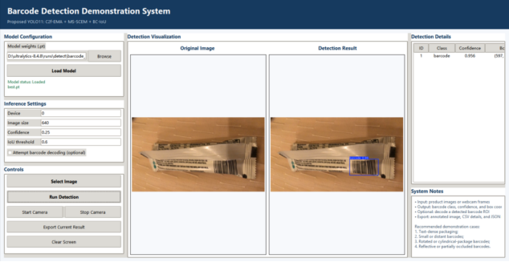

# SA-YOLO

Code for **SA-YOLO: Shape-Aware Product Barcode Detection with Multi-Scale Attention and Strip Convolutions in Complex Retail Scenes**.

SA-YOLO is a single-class detector for 1D product barcodes. The implementation is based on Ultralytics YOLO11 and includes three changes used in the manuscript:

- `C2f_EMA` for attention-based feature extraction;
- `MS_SCEM` for multi-scale strip convolutions;
- `BC-IoU` for bounding-box regression.

## Installation

```bash
git clone https://github.com/FumBleW/SA-YOLO.git
cd SA-YOLO

python -m venv .venv
# Windows: .venv\Scripts\activate
# Linux/macOS: source .venv/bin/activate

pip install -r requirements.txt
pip install -e . --no-deps
```

## Dataset

The experiments use the [KAIST 1D Barcode (DEAL/QuickBrowser) dataset](https://www.resl.kaist.ac.kr/doc/datasets). The dataset is not distributed with this repository.

By default, the scripts look for:

```text
datasets/kaist_barcode/data.yaml
```

The path can also be supplied through the `SA_YOLO_DATA` environment variable. The YAML file should use the standard Ultralytics detection format and define the `train`, `val`, and `test` splits.

## Usage

The SA-YOLO model configuration is located at:

```text
ultralytics/cfg/models/11/yolo11-c2fema-msscem.yaml
```

Train from random initialization:

```bash
python train.py
```

Evaluate a trained checkpoint:

```bash
# Windows PowerShell
$env:SA_YOLO_WEIGHTS="path/to/best.pt"
python test.py

# Linux/macOS
SA_YOLO_WEIGHTS="path/to/best.pt" python test.py
```

Training outputs are written to `runs/detect/sa_yolo`. Evaluation outputs are written to `outputs/test_set_evaluation_results`.

## Results

Results reported in the manuscript on the KAIST 1D Barcode test split (`imgsz=640`):

| Precision (%) | Recall (%) | mAP@0.5 (%) | mAP@0.5:0.95 (%) |
|---:|---:|---:|---:|
| 94.1 | 95.0 | 98.3 | 61.1 |

The reported model was initialized from the YAML configuration without pretrained weights. The training settings used by `train.py` are summarized below.

| Setting | Value |
|---|---:|
| Epochs | 200 |
| Batch size | 16 |
| Input size | 640 × 640 |
| Optimizer | SGD |
| Initial learning rate (`lr0`) | 0.001 |
| Final learning-rate factor (`lrf`) | 0.01 |
| Warmup epochs | 5 |
| Momentum | 0.937 |
| Weight decay | 0.001 |
| Early-stopping patience | 20 |
| Loss weights (`box`, `cls`, `dfl`) | 10.0, 0.2, 1.5 |

For reproducibility, training uses `seed=42` with `deterministic=True`. The current script is configured for one CUDA device (`device=0`) and uses `workers=0`.

The augmentation settings are `degrees=180`, `shear=15`, `hsv_h=0.015`, `hsv_s=0.7`, `hsv_v=0.4`, `fliplr=0.5`, `flipud=0.5`, `mosaic=1.0`, and `mixup=0.5`; copy-paste augmentation is disabled. Test-set evaluation uses batch size 16, confidence threshold 0.001, and IoU threshold 0.6.

Model weights are not included in the repository.

## Desktop demo

A small Tkinter application is provided in [`barcode_detection_app`](barcode_detection_app). It supports image and webcam inference, result visualization, and CSV/JSON export.

```bash
pip install -r barcode_detection_app/requirements.txt
python barcode_detection_app/barcode_detection_app.py
```

Barcode decoding through `pyzbar` is optional and is separate from the detection evaluation.



## Main files

```text
train.py                                      training script
test.py                                       evaluation script
barcode_detection_app/                       desktop demo
assets/                                      figures used in this README
ultralytics/cfg/models/11/                    model configurations
ultralytics/nn/other_modules/                 custom modules
ultralytics/utils/metrics.py                  BC-IoU implementation
```

## Citation

```bibtex
@article{fang2026sayolo,
  title  = {SA-YOLO: Shape-Aware Product Barcode Detection with Multi-Scale Attention and Strip Convolutions in Complex Retail Scenes},
  author = {Fang, Bowen},
  year   = {2026},
  note   = {Manuscript}
}
```

## Acknowledgements

This project is built on [Ultralytics YOLO](https://github.com/ultralytics/ultralytics). Please also follow the license and citation requirements of the dataset and other third-party components used in your experiments.

## License

The code is released under the [GNU Affero General Public License v3.0](LICENSE), consistent with the bundled Ultralytics source.

## Contact

Bowen Fang — 24711006@bjtu.edu.cn
